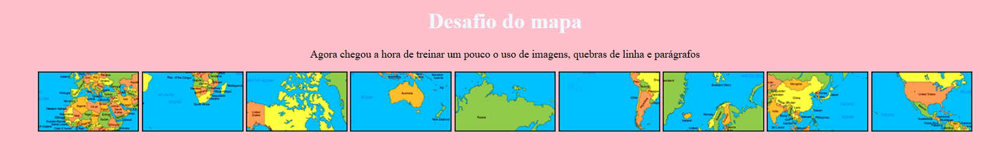
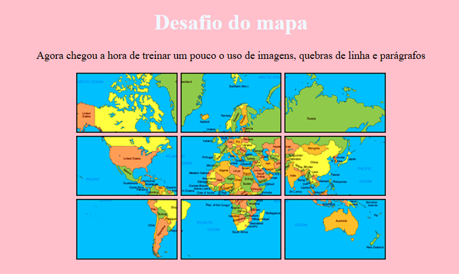

# Desafio do mapa :world_map:

Projeto de treino onde pratiquei:

- Inserção de imagens no HTML (&lt;img&gt;)
- Quebra de linha (&lt;br&gt;)
- Criação de parágrafos (&lt;p&gt;)

## Prévia do Projeto

### Antes

### Depois

## Como acessar

[Acesse aqui o projeto online](https://p4ul4v3rs0.github.io/Desafio-do-mapa/)
